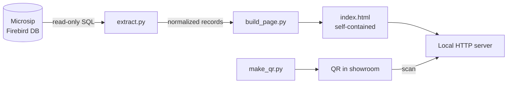

# Microsip Inventory → QR Stock Page

**Live demo:** https://luisdelat710.github.io/microsip-inventario-qr/ *(sample data)*

A lightweight tool that pulls live stock levels from a **Microsip ERP** (Firebird database) and publishes them as a mobile-friendly web page on the store's local network. Customers and sales staff scan a QR code in the showroom and see what's actually in stock, in boxes and square meters, without asking at the counter.

Built for a tile and flooring distributor in Zacatecas, Mexico, where I was General Manager.

<p align="center">
  
  &nbsp;&nbsp;&nbsp;
  
</p>

---

## The business problem

In a tile showroom, the most common question is *"do you have enough of this for my project?"* Answering it meant a salesperson walking to the ERP terminal, looking up the product, and converting boxes to square meters by hand. That cost time on every sale and customers sometimes left without an answer.

The stock data already existed in Microsip. It just wasn't reachable from the showroom floor.

## The solution



1. **Extract**: a read-only query sums entries minus exits per item from Microsip's inventory balances (`sql/existencias.sql`).
2. **Normalize**: Microsip packs most product info into the item name (`PISO JARAL 36X36 BEIGE 1RA 2.08 M2`). The script parses out category, format, quality grade and m² per box, then calculates total m² available.
3. **Publish**: data is injected into a single self-contained HTML file. No internet, no cloud, no database on the page side.
4. **Share**: a QR code pointing to the page's local address is printed and placed in the showroom.

The page includes search, category filters, stock status (available / running low / out of stock) and a swatch drawn in each tile's real proportions (an 18×60 plank looks like a plank, a 60×60 looks square).

## The technical challenge

Microsip is not designed to be integrated with. There is no public API, and the Firebird database is usually locked down behind the vendor's installation. Getting data out required:

- Connecting directly to the Firebird server on the store's LAN, which depends on the Firebird version and client library matching the ERP's.
- Creating a **dedicated read-only user** instead of using `SYSDBA`, so the tool could never alter ERP data.
- Mapping Microsip's internal tables (`ARTICULOS`, `CLAVES_ARTICULOS`, `SALDOS_IN`) without official documentation.

Because of these constraints, the production version never reached a stable, always-on state. This repository is a **cleaned-up, reproducible version of the project**: the real pipeline design, with a demo mode that runs on sample data so anyone can try it without a Microsip installation.

## What I'd do differently

- Run the extraction on a schedule (Windows Task Scheduler) and write a static file, instead of depending on a live connection.
- Push a sanitized snapshot to a hosted page so it works outside the store's Wi-Fi.
- Ask the Microsip vendor early about supported export options before going direct to the database.

## Run it

Requires Python 3.9+.

```bash
pip install -r requirements.txt

# Demo with sample data (no Microsip needed)
python run.py --demo --serve
```

Open the URL it prints, or scan `output/qr.png` from a phone on the same Wi-Fi.

To use it against a real Microsip database, copy `config.example.ini` to `config.ini`, fill in the connection details and warehouse ID, and run `python run.py --serve`. Verify table and column names against your Microsip version first.

## Project structure

```
├── run.py                  # pipeline entry point
├── src/
│   ├── extract.py          # Firebird / CSV extraction and normalization
│   ├── build_page.py       # injects data into the HTML template
│   └── make_qr.py          # detects LAN IP and generates the QR
├── sql/existencias.sql     # stock query against Microsip tables
├── templates/inventario.html
├── sample_data/            # fictional inventory for the demo
└── docs/demo/              # generated demo page, screenshot, QR
```

## My role

I defined the problem, the business rules (how stock is calculated, how m² are derived, what counts as "running low") and the data mapping from Microsip, and directed the implementation using AI-assisted development, validating every output against real inventory.

---

### En español

Herramienta que extrae existencias de **Microsip** (base de datos Firebird) y las publica en una página web local. El cliente escanea un QR en la tienda y ve qué hay disponible en cajas y m². El reto principal fue que Microsip no tiene API y el acceso directo a Firebird es limitado; este repositorio es una versión demostrativa y reproducible del proyecto, con datos ficticios.

*All inventory data in this repository is fictional. Microsip is a trademark of its respective owner; this project is not affiliated with it.*
